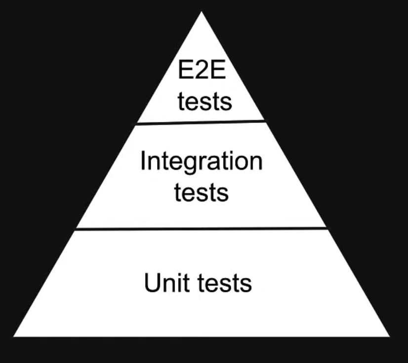

# React Testing Tutorial

# Introduction
## Testing
- As a developer, our primary goal is to build software that works.
- To ensure our software works, we test the application.
- We check if our software works as expected.

### Manual Testing
- An individual will open the website, interact with the website and ensure
everything works as intended.

- If a new feature is released, you repeat the same steps.

- you have to test not only the new feature but also the existing features.

- Drawbacks: 
  - time-consuming.
  - Complex repetitive tasks has a risk of human error.
  - You may not get a chance to test all the features you should

### Automated testing
- Automated tests are programs that automate the task of testing your software.
- Write code to test the software code.
- Additional effort required when you develop a feature.

- Advantages:
  - Not time consuming.
  - Reliable, consistent and not error prone.
  - Easy to identify and fix features that break tests.
  - Gives confidence when shipping software.

## Course structure 

- Jest and React Testing Library
- Fundamentals of writing a test
- Test components with use interactions 
- Test components wrapped in a provider
- Test components with mocking
- Static analysis testing

## Prerequisites
- React fundamentals
- TypeScript fundamentals

# Jest vs React Testing Library (RTL)
## JEST
- Jest is a javascript testing framework.
- Jest is a test runner that finds tests, runs the tests, determines whether the
tests passed or failed and reports it back in a human readable manner.

## React Testing Library (RTL)
- Javascript testing utility that provides virtual DOM for testing React components.

- React Testing Library provides a virtual DOM which we can use to interact with
and verify the behaviour of a react component.

- Testing Library in in fact a family of packages which helps test UI components.

- The core library is called DOM Testing library an RTL is simply a wrapper around 
this core library to test React applications in an easier way.

# Types of Tests
- Unit tests
- Integration tests
- End to end (e2e) tests

### Unit tests 
- Focus is on testing the individual building blocks of an application such as a class
or a function or a component.

- Each unit or building block is tested in isolation, independent of other units.

- Dependencies are mocked.

- Run in a short amount of time and make it very easy to pinpoint failures.

- Relatively easier to write and maintain.

### Integration tests
- Focus is on testing a combination of units and ensuring they work together.
- Take longer than unit tests.

### E2E tests
- Focus is on testing the entire application flow and ensuring it works as designed
from start to finish.
- Involves in a real UI, a real backed database, real services, etc.

- Take the longest as they cover the most amount of code.

- Have a cost implication as you interact with real API's that may charge based on
the number of requests.

## Testing pyramid

As you move up the pyramid your testing becomes more complex. And the amount 
get smaller. This depends on the nature of the project.

Unit tests are the easiest to write and maintain, but the e2e tests give you the most confidence, as 
they closely resemble a user testing your app.

## RTL Philosophy
> "The more your tests resemble the way your software is used, the more confidence they can give you."

Test we are going to apply in this repo strike a balance between unit tests in
the sense, they are at a component level and easy to write and maintain and E2E tests in
the sense they resemble the way a user would 8interact with the component.

With React Testing Library, we are not concerned about the implementation details of a 
component.

Instead we are testing how the component behaves when a user interacts with it.

React Testing Library will not care if you add 4+4 or 5+3 to display the number 8.

Refactoring will not affect your test as long as the end result is the same.

## Conclusion
- There are three types of tests: unit, integration and end to end.
- React Testing Library strikes a balance between unit and E2E tests which is what we will be learning 
in the rest of the series.

# What is a Test?
